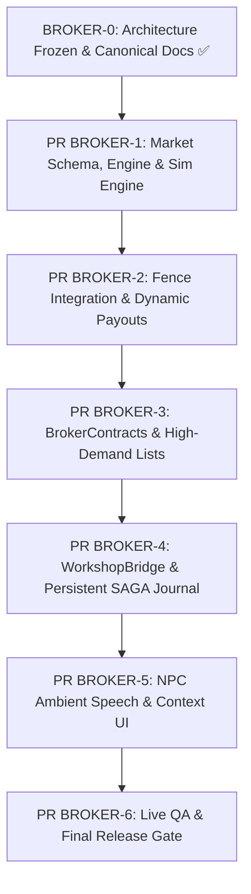

# BROKER IMPLEMENTATION ROADMAP — vp_chopshop v1.17

**Data:** 2026-09-01 (Revisão BROKER-0.2)  
**Autor:** Lead Gameplay Systems Architect & Principal Engineer  
**Status:** PLANO DE IMPLEMENTAÇÃO EM FASES — DESIGN CONGELADO (BROKER-0 FROZEN)

---

## 1. Estratégia de Migração do Banco de Dados

Para garantir compatibilidade total sem perda de progresso dos jogadores existentes:

### 1.1. Tabela de Trust (`vp_chop_fence_trust`) $\to$ **REUSAR**
A tabela existente é 100% compatível com a progressão do Broker:
- `trust_level` (0 a 4) permanece como o nível visível de acesso.
- `trust_xp` continua acumulando para avanço de nível.
- `last_seen` mantém o decay passivo de 7 dias.

### 1.2. Tabela de Ordens $\to$ Evolução para `vp_chop_broker_contracts`
Migração não destrutiva da antiga tabela `vp_chop_fence_orders` para `vp_chop_broker_contracts`:

```sql
CREATE TABLE IF NOT EXISTS `vp_chop_broker_contracts` (
    `id`             INT UNSIGNED NOT NULL AUTO_INCREMENT,
    `for_identifier` VARCHAR(60)  NULL DEFAULT NULL, -- NULL = Contrato Global / Janela Pública
    `contract_type`  VARCHAR(30)  NOT NULL DEFAULT 'part_type', -- 'part_type' | 'model' | 'class' | 'high_value'
    `target_key`     VARCHAR(50)  NOT NULL, -- ex: 'adv_engine', 'sultan', 'SUV'
    `quantity`       SMALLINT UNSIGNED NOT NULL DEFAULT 1,
    `remaining`      SMALLINT UNSIGNED NOT NULL DEFAULT 1,
    `reward_mult`    DECIMAL(4,2) NOT NULL DEFAULT 1.00,
    `bonus_cash`     INT UNSIGNED NOT NULL DEFAULT 0,
    `min_trust`      TINYINT UNSIGNED NOT NULL DEFAULT 1,
    `created_at`     TIMESTAMP    NOT NULL DEFAULT CURRENT_TIMESTAMP,
    `expires_at`     TIMESTAMP    NOT NULL,
    `fulfilled_at`   TIMESTAMP    NULL DEFAULT NULL,
    `state`          VARCHAR(20)  NOT NULL DEFAULT 'AVAILABLE', -- 'AVAILABLE' | 'ACCEPTED' | 'COMPLETED' | 'EXPIRED'
    PRIMARY KEY (`id`),
    INDEX `idx_contracts_lookup` (`for_identifier`, `state`, `expires_at`),
    INDEX `idx_contracts_global` (`for_identifier`, `state`)
) ENGINE=InnoDB DEFAULT CHARSET=utf8mb4 COLLATE=utf8mb4_unicode_ci;
```

### 1.3. Tabela de Snapshot de Mercado (`vp_chop_broker_market`)
```sql
CREATE TABLE IF NOT EXISTS `vp_chop_broker_market` (
    `commodity`      VARCHAR(50)  NOT NULL,
    `demand_index`   DECIMAL(4,3) NOT NULL DEFAULT 1.000,
    `recent_volume`  INT UNSIGNED NOT NULL DEFAULT 0,
    `last_recovery`  TIMESTAMP    NOT NULL DEFAULT CURRENT_TIMESTAMP,
    PRIMARY KEY (`commodity`)
) ENGINE=InnoDB DEFAULT CHARSET=utf8mb4 COLLATE=utf8mb4_unicode_ci;
```

### 1.4. Tabela de Journal de Transações de Oficinas (`vp_chop_workshop_journal`)
```sql
CREATE TABLE IF NOT EXISTS `vp_chop_workshop_journal` (
    `txn_id`          VARCHAR(80)       NOT NULL,
    `provider`        VARCHAR(40)       NOT NULL,
    `player_key`      VARCHAR(60)       NOT NULL,
    `entitlement_id`  VARCHAR(64)       NOT NULL,
    `part_key`        VARCHAR(50)       NOT NULL,
    `price`           INT UNSIGNED      NOT NULL,
    `state`           VARCHAR(20)       NOT NULL, -- 'PREPARED' | 'RESERVED' | 'COMMITTING' | 'COMMITTED' | 'FINALIZED' | 'ABORTED' | 'QUARANTINE'
    `reconcile_count` TINYINT UNSIGNED  NOT NULL DEFAULT 0,
    `metadata`        TEXT              NULL,
    `created_at`      TIMESTAMP         NOT NULL DEFAULT CURRENT_TIMESTAMP,
    `updated_at`      TIMESTAMP         NOT NULL DEFAULT CURRENT_TIMESTAMP ON UPDATE CURRENT_TIMESTAMP,
    PRIMARY KEY (`txn_id`),
    INDEX `idx_journal_recovery` (`state`, `updated_at`),
    INDEX `idx_journal_entitlement` (`entitlement_id`)
) ENGINE=InnoDB DEFAULT CHARSET=utf8mb4 COLLATE=utf8mb4_unicode_ci;
```

---

## 2. Sequência de PRs em Execução (Stack Modular v1.17)



### BROKER-0: Architecture Frozen & Canonical Design ✅
- Consolidação arquitetural e auditoria de segurança (BROKER-0, 0.1 e 0.2).
- Modelagem de persistência e SAGA recovery para transações externas.

### PR BROKER-1: Market Schema, Pricing Engine & Economic Simulation Engine
- Schema de persistência de mercado: `vp_chop_broker_market` em `sql/vp_chopshop.sql` e `server/db.lua`.
- Implementação de `server/broker/market.lua`:
  - `BrokerMarket.GetDemandIndex(commodity, timestamp)`
  - `BrokerMarket.ResolvePrice(commodity, context)` (com regra estrita: Trust 0 ou Burning Heat = `NO TRADE`)
  - `BrokerMarket.RecordSale(commodity, count, timestamp)`
  - `BrokerMarket.RecoverDemand(commodity, timestamp)` (Lazy Time Recovery assintótica)
  - `BrokerMarket.GetSnapshot(commodity, timestamp)` e `BrokerMarket.Flush(timestamp)`
- **Suíte de Simulação Obrigatória:** Execução de `market_sim_spec.lua` (1.000+ iterações sintéticas provando monotonicidade, floor, ceiling, jitter determinístico e recovery assintótico).
- **Testes:** Cobertura de `MARKET-01` a `MARKET-09` e testes de propriedades sobre o módulo real.
- **Zero alteração nos payouts do Fence atual** (integração mantida para BROKER-2).

### PR BROKER-2: Fence Integration & Market Resolution
- Conexão de `sellCatalytic`, `sellTyres` e `sellItems` com a engine do `BrokerMarket`.
- Venda direta de peças com `PartEntitlement` (`adv_engine`, `doors`, `bonnet`) no Broker.

### PR BROKER-3: Contracts & Demand Lists
- Implementação de `server/broker/contracts.lua`.
- Geração de contratos globais (janelas de alta demanda) e contratos pessoais por Trust.
- Suporte a demandas por Modelo (`Sultan`, `Bison`), Classe (`Sports`, `SUV`) e Peças Físicas.
- Cobertura de `BROKER-SEC-01` a `BROKER-SEC-10`.

### PR BROKER-4: WorkshopBridge & Persistent SAGA Journal
- Criação de `bridge/workshop.lua` com orquestração persistente em `vp_chop_workshop_journal`.
- Boot recovery sweeper para transações em `COMMITTING`/`RECONCILING`.
- Resolução de caller identity server-side para `stolen_plate` com preservação completa de metadados.
- Criação do template `bridge/workshop_custom_example.lua`.
- Cobertura de `WORKSHOP-01` a `WORKSHOP-07`.

### PR BROKER-5: NPC Persona & Contextual UI
- Adição de diálogos contextuais no `ox_lib context` baseados em saturação, alta demanda e heat.
- Integração de falas ambientais nativas (`PlayPedAmbientSpeechNative`).
- Suporte completo a locales (PT / EN / ES / FR / TR).

### PR BROKER-6: Integration & Release Candidate Gate
- Teste de regressão completo de todas as suítes do harness.
- Auditoria final de concorrência multiplayer e persistência pós-restart.
- Homologação In-Game com o Dono / QA.

---

## 3. Diretrizes de Execução & Release Gate

- **Base de Trabalho:** Toda PR da v1.17 será ramificada a partir de `pr-h` após a release final da v1.16.
- **Uma mudança por PR:** Submissão com commits atômicos, harness verde (`lua tools/run_spec.lua .`) e conferência estrita.
- **Nenhum Merge Automático:** Cada PR aguarda o **GO explícito** do dono do projeto antes de ser mergeada com `gh pr merge <id> --squash --delete-branch`.
