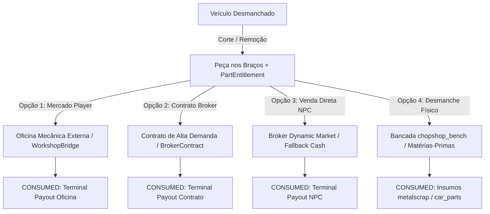

# BROKER PRODUCT DESIGN — vp_chopshop v1.17

**Data:** 2026-09-01  
**Autor:** Lead Gameplay Systems Architect  
**Status:** DESIGN DE PRODUTO & EXPERIÊNCIA DO JOGADOR — PENDENTE DE APROVAÇÃO

---

## 1. Visão Geral do Produto

Na versão v1.16, o `vp_chopshop` aperfeiçoou com maestria o **"COMO desmanchar"** (corte físico de painéis, minigame 5-bolt de rodas com câmera ortogonal, remoção de motor com chave de fenda/drill, corte estrutural da carcaça com maçarico de solda, transporte físico nos braços e furto de catalisador).

A versão **v1.17 (Chop Broker & Modular Market)** responde às perguntas econômicas e narrativas que dão sentido duradouro à atividade criminosa:
- *"Por que vale a pena roubar esse modelo hoje?"*
- *"Quem está pagando mais por esse motor: o Broker, uma oficina mecânica ou vale mais transformar em materiais na bancada?"*
- *"Qual peça está com demanda saturada na cidade?"*
- *"O que meu contato criminal de confiança precisa com urgência?"*

O objetivo é transformar o desmanche em um **pequeno ecossistema de suprimento ilegal vivo**.

---

## 2. Princípio da Hierarquia de Liquidez

A economia do `vp_chopshop v1.17` segue 4 camadas hierárquicas claras:

```
                      1. OFICINAS / JOGADORES (Player Economy)
                         [Maior Valor / Negociação Livre]
                                      │
                                      ▼
                      2. CONTRATOS ESPECIAIS (Broker Contracts)
                         [Alto Valor / Janelas de Tempo / Demandas Específicas]
                                      │
                                      ▼
                      3. MERCADO FALLBACK DO NPC (Broker Dynamic Market)
                         [Liquidez Garantida / Preço Base com Pressão de Volume]
                                      │
                                      ▼
                      4. BANCADA DE PROCESSAMENTO (Bench Crafting)
                         [Conversão Segura em Insumos / Metalscrap / Peças Limpas]
```

### Regra de Ouro da Liquidez:
1. **O NPC nunca substitui o jogador:** Quando houver demanda em oficinas mecânicas de jogadores (via `WorkshopBridge`), negociar com players deve normalmente oferecer melhor retorno financeiro do que vender ao NPC.
2. **O jogador nunca fica preso:** Se a cidade estiver vazia, sem mecânicos online ou sem oficinas comprando, o Broker NPC garante liquidez imediata com ajuste dinâmico de preço.
3. **A bancada é a rede de segurança:** Se o mercado do NPC estiver saturado para determinada peça, o jogador sempre tem a escolha econômica de converter a peça física em matérias-primas na `chopshop_bench`.

---

## 3. O Chop Broker: Um Contato Criminal Vivo

Em vez de poluir o mapa com múltiplos NPCs com funções redundantes (ex: um "Fence" para itens e um "Broker" para listas), o NPC Fence existente evolui narrativamente e estruturalmente para o **CHOP BROKER**.

### Estrutura Unificada do Broker:

```
                                  CHOP BROKER
                               (NPC Rotativo)
                    ┌─────────────────┼─────────────────┐
                    │                 │                 │
             1. MERCADO GERAL   2. CONTRATOS      3. SERVIÇOS & INFO
             • Venda de Peças   • Encomendas      • Reputação/Trust
             • Catalisadores    • Carros Hot      • Venda de Bancada
             • Pneus (Truck)    • Demandas Espec. • Sinais de Mercado
             • Placas Roubadas  • Alta Demanda    • Dicas Policiais
```

---

## 4. Personalidade & Reações Contextuais do NPC

O Broker deixa de ser um menu passivo de compras e expressa a realidade das ruas por meio de falas ambientais nativas (`PlayPedAmbientSpeechNative`), notificações visuais e descrições dinâmicas no `ox_lib context`:

| Situação | Reação Narrativa do Broker | Comportamento no Sistema |
|---|---|---|
| **Primeiro Contato (Trust 0)** | *"Quem te mandou aqui? Não faço negócio com desconhecido."* | Exige `fence_referral` para liberar interação. |
| **Trust Baixo (Trust 1)** | *"Não espalha que me viu. Mostra o que você tem aí."* | Revela apenas preços básicos e categorias gerais. |
| **Trust Alto (Trust 3–4)** | *"Tenho clientes importantes procurando peças exclusivas. Dá uma olhada nos contratos."* | Revela valores exatos de demanda, contratos de alta margem e blip exato. |
| **Mercado Saturado** | *"A cidade tá inundada de motores hoje. Não pago mais que o básico nisso."* | Multiplicador de demanda no piso (`MinDemandMultiplier`). |
| **Alta Demanda Ativa** | *"Se você conseguir um catalisador de SUV na próxima hora, eu dobro a comissão."* | Contrato temporário com bônus e quantidade limitada. |
| **Heat / Alerta Policial Alto** | *"A polícia tá na sua cola! Some daqui antes que tragam os federais pra minha porta!"* | Recusa atendimento temporária ou aplica penalidade de risco. |
| **Contrato Expirado** | *"Chegou tarde demais. Meu cliente já comprou de outro."* | Invalida entrega de contrato vencido; sugere venda no mercado normal. |
| **Tentativa de Vender Peça Errada** | *"Não é isso que eu te pedi. Não me faça perder tempo."* | Validação estrita de modelo/classe/peça server-side. |

---

## 5. Menus de Interação do Jogador (UI/UX MVP via ox_lib)

A experiência do usuário utilizará menus imersivos no `ox_lib context`, sem necessidade de NUI pesada inicial:

```
┌─────────────────────────────────────────────────────────┐
│               CHOP BROKER — MERCADO NEGRO               │
├─────────────────────────────────────────────────────────┤
│ [📊] Sinais do Mercado                                  │
│      • Catalisadores: EM ALTA (115% — $1.850–$2.100)     │
│      • Motores: NORMAL (100% — $2.700)                  │
│      • Pneus: SATURADO (70% — $280/un)                  │
├─────────────────────────────────────────────────────────┤
│ [📜] Contratos Disponíveis                              │
│      • [URGENTE] 2x Catalisador de SUV (+25% bônus)     │
│      • [ENCOMENDA] Motor de Esportivo (Sultan/Buffalo)  │
│      • [HOT JOB] Entregar Veículo Raro Intacto          │
├─────────────────────────────────────────────────────────┤
│ [📦] Vender Peça nos Braços                             │
│      • Vender Catalisador Carregado                     │
│      • Vender Motor / Porta Carregada                   │
├─────────────────────────────────────────────────────────┤
│ [🛻] Logística de Pneus (Descarregar Caçamba)           │
├─────────────────────────────────────────────────────────┤
│ [💼] Vender Matérias-Primas do Inventário               │
├─────────────────────────────────────────────────────────┤
│ [⭐] Reputação & Informações de Contato                 │
└─────────────────────────────────────────────────────────┘
```

---

## 6. Diferenciação de Destinos para Peças Físicas

Cada peça física com `PartEntitlement` removida de um veículo possui **uma única destinação terminal**:



Essa multiplicidade de caminhos garante profundidade de gameplay e valorização estratégica de cada veículo roubado na cidade.
