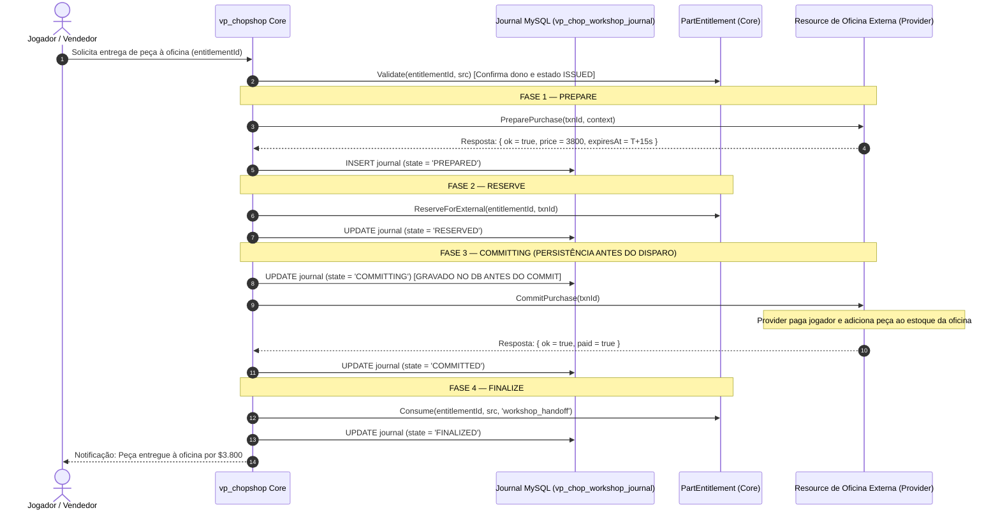

# BROKER WORKSHOP INTEGRATION — vp_chopshop v1.17

**Data:** 2026-09-01 (Revisão BROKER-0.2)  
**Autor:** Lead Systems Architect & Integration Engineer  
**Status:** ESPECIFICAÇÃO DE INTEGRAÇÃO MODULAR COM OFICINAS EXTERNAS — PROTOCOLO SAGA COM PERSISTENT TRANSACTION JOURNAL (DESIGN FROZEN)

---

## 1. Princípio da Modularidade Absoluta

O `vp_chopshop` **NÃO** implementa sistemas de oficina, estoque interno, contas bancárias de empresas (*society*) ou folha de pagamento de mecânicos. O resource provê exclusivamente uma **camada de integração e orquestração de entrega segura** (`WorkshopBridge` / `WorkshopAdapter`).

### Divisão Estrita de Responsabilidades:

| Domínio | Responsabilidade do `vp_chopshop` | Responsabilidade do Resource de Oficina Externa |
|---|---|---|
| **Identidade & Provenance** | `PartEntitlement`, modelo, classe, integridade física, número de série, histórico de desmanche. | Uso da peça em customizações, reparos e tunings de clientes. |
| **Orquestração SAGA & Journal** | Persistência do estado da transação (`vp_chop_workshop_journal`), ciclo de vida *at-most-once*, reconciliação pós-restart. | Gestão de estoque da oficina, inventário da empresa, UI de pedidos. |
| **Finanças & Liquidez** | Liquidez fallback do NPC Broker se a oficina estiver offline/indisponível. | Definição de preço, débito em conta da empresa (*society balance*), pagamento do mecânico. |

---

## 2. Persistent External Transaction Journal (`vp_chop_workshop_journal`)

Para garantir que uma transação inter-resource que movimentou dinheiro externo sobreviva a qualquer falha ou reinicialização do servidor, o estado da SAGA **nunca depende apenas de tabelas Lua em RAM**.

### 2.1. Schema da Tabela de Journal
```sql
CREATE TABLE IF NOT EXISTS `vp_chop_workshop_journal` (
    `txn_id`          VARCHAR(80)       NOT NULL, -- ex: 'ws:custom:9842:1772489000'
    `provider`        VARCHAR(40)       NOT NULL,
    `player_key`      VARCHAR(60)       NOT NULL,
    `entitlement_id`  VARCHAR(64)       NOT NULL,
    `part_key`        VARCHAR(50)       NOT NULL,
    `price`           INT UNSIGNED      NOT NULL,
    `state`           VARCHAR(20)       NOT NULL, -- 'PREPARED' | 'RESERVED' | 'COMMITTING' | 'COMMITTED' | 'FINALIZED' | 'ABORTED' | 'QUARANTINE'
    `reconcile_count` TINYINT UNSIGNED  NOT NULL DEFAULT 0,
    `metadata`        TEXT              NULL,
    `created_at`      TIMESTAMP         NOT NULL DEFAULT CURRENT_TIMESTAMP,
    `updated_at`      TIMESTAMP         NOT NULL DEFAULT CURRENT_TIMESTAMP ON UPDATE CURRENT_TIMESTAMP,
    PRIMARY KEY (`txn_id`),
    INDEX `idx_journal_recovery` (`state`, `updated_at`),
    INDEX `idx_journal_entitlement` (`entitlement_id`)
) ENGINE=InnoDB DEFAULT CHARSET=utf8mb4 COLLATE=utf8mb4_unicode_ci;
```

---

## 3. Protocolo SAGA Persistente em 5 Fases



---

## 4. Semântica Rigorosa de Estados e Abort

1. **`PREPARED` & `RESERVED`:**
   - O dinheiro **não** foi transferido.
   - O cancelamento local ou timeout nesta etapa executa `AbortPurchase(txnId)` no provider.
   - Após confirmação de `ABORTED` do provider (ou timeout antes do envio do commit), o journal é marcado como `ABORTED` e o `entitlement` é liberado com segurança de volta para `ISSUED`.
2. **`COMMITTING`:**
   - **Regra de Ouro:** O estado `COMMITTING` é gravado no MySQL **ANTES** da chamada de rede `CommitPurchase`.
   - **Timeout pós-commit NÃO significa falha.** O entitlement **NUNCA** volta para `ISSUED` por timeout ou exceção de rede.
   - O `vp_chopshop` entra em reconciliação ativa consultando `GetTransactionStatus(txnId)`.
3. **`COMMITTED`:**
   - O provider confirmou que o pagamento foi executado.
   - O entitlement é **PERMANENTEMENTE TERMINAL**. É terminantemente proibido restaurar o entitlement para `ISSUED`.
4. **`FINALIZED`:**
   - Ciclo concluído: journal atualizado e `PartEntitlement` marcado como `CONSUMED`.
5. **`ABORTED`:**
   - Estado terminal de cancelamento. Exige confirmação formal do provider de que nenhum saldo foi movimentado.
6. **`QUARANTINE`:**
   - Estado de contenção ativado se o provider permanecer incontactável ou se a persistência local falhar após o limite de retries operacionais. Mantém a peça travada (*fail-closed*) e emite alerta `CRITICAL` para auditoria administrativa.

---

## 5. Prova de Recuperação Pós-Restart (Restart Proof Design)

### Cenário de Crash no Ponto Mais Crítico:
```
1. vp_chopshop grava no MySQL: journal.state = 'COMMITTING'.
2. vp_chopshop dispara CommitPurchase(txnId) para o provider.
3. O provider credita $3.800 na conta do jogador e adiciona a peça à oficina.
4. O servidor FiveM / resource sofre CRASH ou REBOOT antes da resposta chegar ao vp_chopshop.
```

### Comportamento no Boot (Zero Dupe / Zero Loss):
```
1. No boot, o Boot Sweeper do vp_chopshop executa:
   SELECT * FROM vp_chop_workshop_journal WHERE state IN ('RESERVED', 'COMMITTING', 'RECONCILING', 'QUARANTINE')
2. A transação pendente é carregada com state = 'COMMITTING'.
3. O sweeper aguarda o provider ficar pronto (IsAvailable() == true) e chama:
   provider.GetTransactionStatus(txnId)
4. O provider responde autoritativamente: 'COMMITTED'.
5. O sweeper atualiza:
   - PartEntitlement in-memory e DB -> CONSUMED
   - Journal -> FINALIZED
6. RESULTADO COMPROVADO:
   - Jogador ficou com o dinheiro legítimo do provider.
   - A peça física JAMAIS é restaurada na mão do jogador (Zero Duplicação / Zero Re-desmanche).
   - Transação atinge consistência eventual perfeita.
```

---

## 6. Tratamento de Falha no `FinalizeConsume`

Se o provider responder com sucesso (`paid = true` / `COMMITTED`), mas a query de persistência final do `PartEntitlement` falhar no banco de dados local:
1. O journal da transação permanece em `COMMITTED` / `RECONCILING`.
2. O `PartEntitlement` em memória é **imediatamente retido como `CONSUMED`** (fail-closed em memória).
3. O background sweeper continua tentando persistir o consumo.
4. Se atingir o limite operacional de retries (`MaxCommitRetries = 4`), a transação entra em `QUARANTINE` e um log `CRITICAL` é gravado com `txn_id`, `player_key` e `entitlement_id`.
5. **Em hipótese alguma o entitlement é ressuscitado para `ISSUED`.**

---

## 7. Contrato Obrigatório do Provider (`IWorkshopProvider`)

Todo adapter registrado no servidor deve implementar 4 métodos canônicos idempotentes:

```lua
---@param txnId string ID estável único da transação
---@param context table Dados da peça e vendedor
---@return table { ok: boolean, price: number, expiresAt: number, err?: string }
function Provider.PreparePurchase(txnId, context) end

---@param txnId string ID estável único da transação
---@return table { ok: boolean, paid: boolean, err?: string }
function Provider.CommitPurchase(txnId) end

---@param txnId string ID estável único da transação
---@return string 'PREPARED' | 'COMMITTED' | 'ABORTED' | 'UNKNOWN'
function Provider.GetTransactionStatus(txnId) end

---@param txnId string ID estável único da transação
---@return boolean Confirmado cancelamento sem débito
function Provider.AbortPurchase(txnId) end
```
