# ARCHITECTURE_DEPENDENCY_MAP.md — Subsystem Dependency Graph & Domain Boundaries

> **Status:** CANONICAL DEPENDENCY SPECIFICATION  
> **Baseline:** `v1.18-RC.2`  
> **Target Scope:** Fases 5 a 9 (v1.19 → v1.23)

---

## 1. Grafo Geral de Dependências Arquiteturais

O diagrama abaixo define a árvore estrita de pré-requisitos entre subsistemas. **Nenhuma fase ou sub-fase pode ser iniciada se seus nós pais não estiverem homologados e mergeados.**

```mermaid
graph TD
    %% Base Layer (v1.17 - v1.18)
    subgraph Base_v118 [Fundações Homologadas v1.17 - v1.18]
        WB[WorkshopBridge SAGA Base]
        PE[PartEntitlement & Physical Carry]
        GC[VP_GANGS_CONTRACT v1]
        BM[BrokerMarket & Dynamic Pricing]
        EB[EvidenceBridge V2]
        DB[DispatchBridge V1]
        CS[CarcassLedger & Discard Tombstones]
    end

    %% Phase 5: Workshop Live & Durable Parts
    subgraph Phase_5 [Fase 5: Workshop Live & Peça Durável]
        W_AUDIT[P5.0 Upstream Workshop Audit] --> W_QBX[P5.1 QBox Mechanics Adapter]
        WB --> W_QBX
        W_QBX --> W_EXT[P5.2 Multi-Workshop Adapters]
        W_QBX --> W_B2B[P5.3 B2B Workshop Orders]
        BM --> W_B2B
        
        PE --> PPP[P5.4 Persistent Physical Part / Provenance V2]
        CS --> SRR[P5.5 Selective Restart Recovery RFC]
        PPP --> SRR
    end

    %% Phase 6: Gangs & Territories
    subgraph Phase_6 [Fase 6: Redes Criminosas]
        GC --> TERR[P6.1 Territory Tax / Chop Zones]
        TERR --> TBONUS[P6.2 Territory Economic Bonus]
        TERR --> RIVAL[P6.3 Rival Territory Alerts]
        DB --> RIVAL
        
        PPP --> GCONTR[P6.4 Cooperative Gang Contracts]
        W_B2B --> GCONTR
        
        PPP --> BUYERS[P6.5 Specialized Buyers]
        GC --> PHONE[P6.6 Contacts & Trap Phone]
        BUYERS --> PHONE
    end

    %% Phase 7: Lifecycle & Rebuilding
    subgraph Phase_7 [Fase 7: Ciclo de Vida e Montagem]
        PPP --> COND[P7.1 Condition & Quality V2]
        COND --> COMPAT[P7.2 Part Compatibility Engine]
        COMPAT --> REFURB[P7.3 Part Processing & Refurbishment]
        REFURB --> REUSE[P7.4 Reusable Components]
        W_QBX --> REUSE
        
        COMPAT --> ASSEMB[P7.6 Full Vehicle Assembly]
        REFURB --> ASSEMB
        SALV[P7.5 Salvage Title & Rolling Chassis] --> ASSEMB
        
        ASSEMB --> REBIRTH[P7.7 VIN Rebirth & Civil Registration]
    end

    %% Phase 8: Advanced Economy
    subgraph Phase_8 [Fase 8: Mercado Vivo]
        BM --> REGMKT[P8.1 Regional Market Multipliers]
        TERR --> REGMKT
        W_B2B --> SPEC_DEM[P8.2 Specialized Demand Hierarchy]
        GCONTR --> SPEC_DEM
        BUYERS --> SPEC_DEM
        
        REGMKT --> SCARC[P8.3 Scarcity & Supply Shocks]
        SPEC_DEM --> SCARC
        REFURB --> SINKS[P8.4 Material Sinks & Recycling]
        
        TERR --> AMBUSH2[P8.5 Syndicate Ambush V2]
        GCONTR --> RETAL[P8.6 Contract Retaliation]
        ASSEMB --> AVFX[P8.7 Audio & Mechanical VFX]
    end

    %% Phase 9: Telemetry & Scale
    subgraph Phase_9 [Fase 9: Operações e Escala]
        SPEC_DEM --> TELEM[P9.1 Operations Telemetry]
        SRR --> AUDIT_ADM[P9.2 Transaction Audit Tools]
        TELEM --> ANOMALY[P9.3 Economic Anomaly Detection]
        AUDIT_ADM --> ANOMALY
        
        ANOMALY --> SOAK[P9.4 Multiplayer Soak Testing]
        SRR --> CHAOS[P9.5 Chaos & Crash Recovery QA]
        SOAK --> PERF[P9.6 Resmon & Query Performance Gate]
        CHAOS --> PERF
    end

    style Base_v118 fill:#1a202c,stroke:#4a5568,stroke-width:2px,color:#fff
    style Phase_5 fill:#1e3a5f,stroke:#3182ce,stroke-width:2px,color:#fff
    style Phase_6 fill:#44337a,stroke:#805ad5,stroke-width:2px,color:#fff
    style Phase_7 fill:#234e52,stroke:#319795,stroke-width:2px,color:#fff
    style Phase_8 fill:#744210,stroke:#d69e2e,stroke-width:2px,color:#fff
    style Phase_9 fill:#22543d,stroke:#38a169,stroke-width:2px,color:#fff
```



---

## 2. Matriz de Dependências Duras vs. Opcionais

| Subsistema / Feature | Dependência Dura (Bloqueante) | Dependência Opcional (Melhoria) | Justificativa Arquitetural |
|---|---|---|---|
| **P5.1 QBox Mechanics Adapter** | `P5.0 Upstream Audit`, `WorkshopBridge (v1.17)` | — | Não implementar adapter sem auditoria de export real. |
| **P5.3 B2B Workshop Orders** | `P5.1 QBox Adapter`, `BrokerMarket` | `P5.2 Multi-Adapters` | A ordem B2B consome o pipeline SAGA do adapter ativo. |
| **P5.4 Persistent Physical Part (V2)** | `PartEntitlement (v1.16)` | `ChopSession (v1.15)` | A peça durável ancora sua linhagem no `PartEntitlement`. |
| **P5.5 Selective Restart Recovery** | `P5.4 Persistent Part`, `CarcassLedger` | `WorkshopBridge SAGA` | A recuperação seletiva só pode operar sobre entidades persistentes. |
| **P6.1 Territory Tax / Chop Zones** | `VP_GANGS_CONTRACT (v1.17)` | — | O desmanche consulta o território via bridge isolada sem SQL cruzado. |
| **P6.4 Cooperative Gang Contracts** | `P5.4 Persistent Part`, `P6.1 Territory` | `P5.3 B2B Orders` | Contratos de facção exigem rastreabilidade de peças e território. |
| **P6.5 Specialized Buyers** | `P5.4 Persistent Part`, `VP_GANGS_CONTRACT` | `P6.6 Trap Phone` | A validação física da peça é feita pelo chopshop; o contato pelo gangs. |
| **P7.1 Condition & Quality V2** | `P5.4 Persistent Part` | — | A qualidade precisa de uma entidade persistente onde ser gravada. |
| **P7.2 Part Compatibility** | `P7.1 Condition V2`, `Part Registry (v1.15)` | — | Compatibilidade exige tipagem e classificação canônica. |
| **P7.3 Part Refurbishment** | `P7.2 Compatibility`, `chopshop_bench` | `P5.5 Restart Recovery` | O recondicionamento consome a peça física e emite novo estado. |
| **P7.6 Full Vehicle Assembly** | `P7.3 Refurbishment`, `P7.5 Salvage Chassis` | `P7.4 Reusable Parts` | A montagem é a operação terminal que consome todas as peças compatíveis. |
| **P7.7 VIN Rebirth / Civil Reg.** | `P7.6 Full Assembly`, `qbx_vehicles` | `MDT Integration` | Apenas veículos montados e auditados recebem registro civil. |
| **P8.1 Regional Market** | `BrokerMarket (v1.17)`, `P6.1 Territory` | — | O modificador regional atua sobre o sinal global de preços. |
| **P8.3 Scarcity Events** | `P8.1 Regional Market`, `P8.2 Demand` | — | Choques de oferta alteram a liquidez do mercado dinâmico. |
| **P9.3 Anomaly Detection** | `P9.1 Telemetry`, `P9.2 Audit Tools` | `P5.5 SAGA Journal` | Heurísticas exigem telemetria consolidada de eventos. |

---

## 3. Limites de Fronteira e Domínios (Domain Boundaries)

Para manter a modularidade e impedir acoplamento circular, as responsabilidades entre resources são estritamente delimitadas:

```
┌─────────────────────────────────────────────────────────────────────────────────────────────┐
│ MATRIZ DE AUTORIDADE DE DOMÍNIO                                                            │
├──────────────────────────┬──────────────────────────────────────────────────────────────────┤
│ RESOURCE / SUBSYSTEM     │ RESPONSABILIDADE EXCLUSIVA (AUTORIDADE)                          │
├──────────────────────────┼──────────────────────────────────────────────────────────────────┤
│ vp_chopshop              │ - Veículo físico, NetId e Chassi no mundo FiveM                 │
│                          │ - Sessão de desmanche (ChopSession, ActionSession)               │
│                          │ - Ciclo de vida da peça física (PartEntitlement, Provenance)     │
│                          │ - Compatibilidade mecânica, desmontagem, corte e montagem        │
│                          │ - Payout do desmanche, precificação e liquidez do Broker         │
│                          │ - Perícia policial veicular, raspagem e scanner de VIN           │
├──────────────────────────┼──────────────────────────────────────────────────────────────────┤
│ vp_gangs                 │ - Facções, membros, cargos e hierarquia criminosa                │
│                          │ - Controle territorial, zonas de influência e taxas sociais      │
│                          │ - Contatos do submundo (Mecânico Fantasma, Receptor, etc.)       │
│                          │ - Trap Phone, mensagens de rádio e reputação criminal social     │
├──────────────────────────┼──────────────────────────────────────────────────────────────────┤
│ External Workshop System │ - Gestão da empresa mecânica / Society Fund                      │
│ (ex: qbx_mechanics)      │ - Estoque de tuning cosmético e instalação final no cliente      │
│                          │ - Cobrança de mão-de-obra civil de reparos                       │
├──────────────────────────┼──────────────────────────────────────────────────────────────────┤
│ Evidence System          │ - Armazenamento e renderização de vestígios no chão              │
│ (evidences / crimescene) │ - Coleta de impressões digitais e sangue pela polícia            │
├──────────────────────────┼──────────────────────────────────────────────────────────────────┤
│ Dispatch System          │ - Roteamento de chamados de emergência e alertas policiais       │
│ (cd_dispatch, etc.)      │ - Exibição de blips temporários no GPS policial                  │
└──────────────────────────┴──────────────────────────────────────────────────────────────────┘
```

### Regras Absolutas de Boundary:
1. `vp_chopshop` **nunca** executa queries diretas em tabelas de facções (`vp_gangs_*`) nem de oficinas (`qbx_mechanics_*`).
2. `vp_gangs` **nunca** altera o estado de uma peça física ou sessão de desmanche sem invocar os exports/eventos do `vp_chopshop`.
3. Oficinas externas interagem com o desmanche **exclusivamente** via `WorkshopBridge` (padrão SAGA em 2 fases).
4. Erros ou indisponibilidade de resources externos ativam automaticamente o modo **fail-soft** sem travar o jogador.
