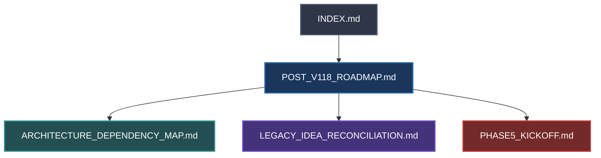

# docs/future/INDEX.md — Post-v1.18 Future Roadmap & Architecture Index

> **Status:** PLANNING / DOCUMENTATION-ONLY — Pre-Phase 5 Foundation  
> **Baseline Base SHA:** `7ba20804cfb4bdffeeadda9b569b610c6fe83586`  
> **Branch de Planejamento:** `docs/post-v118-future-roadmap-prep`  
> **Runtime de Produção:** 100% Congelado em `v1.18-RC.2` (HEAD `7a57ecbd06d60c061f4513991bb98ee559087b94` na PR #52)  
> **Público:** Lead Engineers, Technical Product Architects e Agentes de IA

---

## 1. Visão Geral

Este diretório (`docs/future/`) estabelece o **roadmap arquitetural canônico pós-v1.18** do `vp_chopshop`, cobrindo da **Fase 5 (v1.19)** até a **Fase 9 (v1.23)** e classificando extensões **v2.x (Opcionais/Deferred)**.

Enquanto a homologação humana da v1.18-RC.2 é executada no servidor FiveM, esta frente documental consolida:
1. O detalhamento técnico das próximas fases de desenvolvimento;
2. O grafo estrito de dependências arquiteturais entre subsistemas;
3. A reconciliação exaustiva de todas as ideias históricas, RFCs e pesquisas externas;
4. O plano de execução e kickoff imediato da Fase 5 (Workshop Live & Peça Física Durável).

---

## 2. Mapa de Documentos

```
docs/future/
├── INDEX.md                            ── Este índice geral
├── POST_V118_ROADMAP.md                 ── Roadmap canônico macro e detalhado (Fases 5 a 9 + v2.x)
├── ARCHITECTURE_DEPENDENCY_MAP.md      ── Grafo de dependências duras/opcionais e boundaries de domínio
├── LEGACY_IDEA_RECONCILIATION.md       ── Matriz de conciliação de RFCs legados (Absorbed/Superseded/etc.)
└── PHASE5_KICKOFF.md                   ── Especificação acionável de engenharia para a Fase 5 (P5.0 → P5.5)
```

---

## 3. Ordem de Leitura Recomendada



1. **[`POST_V118_ROADMAP.md`](POST_V118_ROADMAP.md):** Ponto de partida obrigatório. Define os objetivos, contratos e marcos de cada fase futura.
2. **[`ARCHITECTURE_DEPENDENCY_MAP.md`](ARCHITECTURE_DEPENDENCY_MAP.md):** Mapa de pré-requisitos para evitar que qualquer fase seja iniciada sem suas fundações prontas.
3. **[`LEGACY_IDEA_RECONCILIATION.md`](LEGACY_IDEA_RECONCILIATION.md):** Histórico explicativo de por que certos conceitos antigos foram absorvidos, superados ou rejeitados.
4. **[`PHASE5_KICKOFF.md`](PHASE5_KICKOFF.md):** Guia tático de engenharia para o início imediato de P5.0 assim que a v1.18 for mergeada.

---

## 4. Invariantes Arquiteturais Inegociáveis (Guarda-Corpos)

Todas as especificações contidas nesta pasta obedecem rigorosamente às 10 diretrizes de ouro do projeto:

1. **Server-Authoritative First:** O client nunca decide payout, quantidade, elegibilidade, cooldown, compatibilidade ou identidade.
2. **Trust-No-Client:** Callbacks iniciam com `IsValidSource` e `ServerPlayerIsReady`. Zero SQL por concatenação.
3. **At-Most-Once Economic Terminalization:** Operações terminais (discard, venda, fulfill, montagem) consomem direitos irreversivelmente com fail-closed.
4. **No Direct External DB Access:** Integrações com outros resources ocorrem exclusivamente via exports/eventos documentados (Zero cross-table SQL).
5. **Fail-Soft External Bridges:** Falha em bridge externa (oficina, dispatch, evidência, facções) nunca quebra o core de desmanche.
6. **PartEntitlement & Stable Identity:** A autoridade de posse e trânsito de peças permanece ancorada no ledger do servidor.
7. **WorkshopBridge SAGA Pattern:** Transações B2B seguem o protocolo em 2 fases (`PREPARED → COMMITTED / ABORTED`) com quarentena.
8. **Broker Fallback Liquidity:** O mercado NPC é a rede de segurança; a ausência de jogadores/oficinas nunca trava a progressão do jogador.
9. **Forensic Read-Only Purity:** Scanners e perícias inspecionam sem fabricar seriais nem alterar estados de rastreadores.
10. **Strict Domain Boundary (`vp_chopshop` × `vp_gangs`):**
    - `vp_chopshop`: Domínio do veículo, sessão física, peça, compatibilidade, perícia e economia mecânica.
    - `vp_gangs`: Domínio social, reputação, contatos, territórios, facções, Trap Phone e lavagem.

---

## 5. Procedimento de Integração Pós-RC (Merge da PR #52)

Esta branch (`docs/post-v118-future-roadmap-prep`) foi intencionalmente isolada a partir da base `7ba20804` para não poluir a homologação da PR #52.

Assim que a **PR #52 for aprovada e mergeada em `pr-h`**:
1. Executar `git fetch origin` e `git checkout pr-h/v1.15-delivercar-terminal-hardening && git pull --ff-only`;
2. Executar `git checkout docs/post-v118-future-roadmap-prep && git rebase pr-h/v1.15-delivercar-terminal-hardening`;
3. Atualizar o `docs/design/MASTER_IMPLEMENTATION_PLAN.md` refletindo o índice macro das Fases 5 a 9;
4. Abrir PR documental (`docs(roadmap): integrate post-v1.18 future architecture`).
