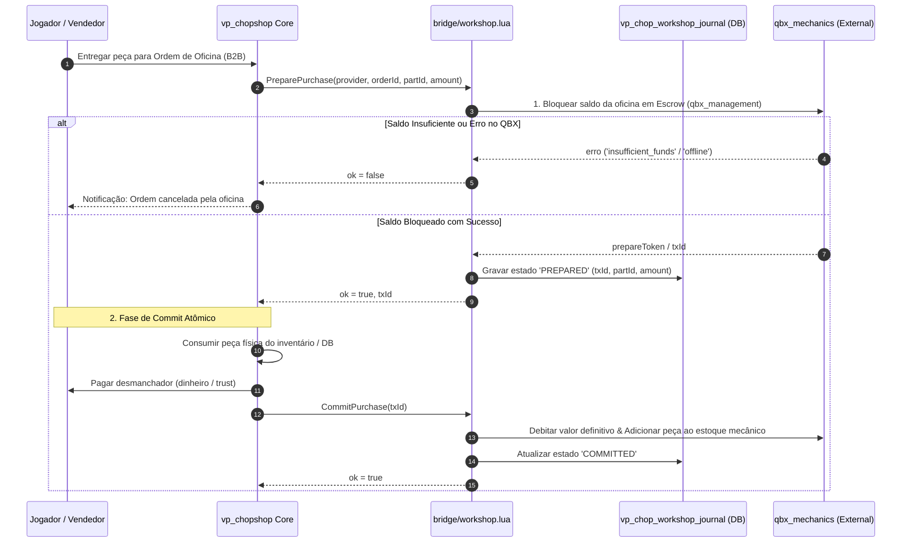

# RFC — P5.1: Workshop SAGA Protocol & QBox Mechanics Adapter

> **Status:** CANONICAL SPECIFICATION / RFC  
> **Fase:** FASE 5 (v1.19) — Workshop Live & Durable Parts Foundation  
> **Dependências:** `WorkshopBridge` (v1.17), `P5.0 Workshop Audit`  
> **Escopo:** Protocolo transacional SAGA em 2 fases, integração com `qbx_mechanics` / `qbx_management` e isolamento de falhas

---

## 1. Arquitetura do Protocolo SAGA

A comunicação entre o `vp_chopshop` e resources externos de oficinas mecânicas opera sob o padrão **SAGA Transacional Distribuído em 2 Fases**, garantindo que dinheiro de oficina e peças de desmanche nunca sejam duplicados ou destruídos indevidamente.



---

## 2. Tratamento de Exceções & Compensação (Rollback)

Se ocorrer uma falha durante o `CommitPurchase` (ex.: crash de rede do `qbx_mechanics` ou queda de script):

1. O `WorkshopBridge` aciona imediatamente a transação de compensação: `AbortPurchase(txId, reason)`.
2. O `qbx_mechanics` devolve os fundos bloqueados para a conta da sociedade mecânica.
3. A peça física no `vp_chopshop` é marcada como `QUARANTINE` e devolvida ao inventário do jogador ou colocada no chão com segurança.
4. Um registro de auditoria é emitido no `vp_chop_workshop_journal` com o motivo da quarentena.

---

## 3. Especificação do Adapter `qbx_mechanics`

O adaptador oficial reside em `bridge/workshop.lua` e implementa os 4 métodos obrigatórios:

```lua
local QBXAdapter = {}

function QBXAdapter.PreparePurchase(params)
    -- 1. Verifica se a sociedade da oficina tem fundos suficientes
    -- 2. Bloqueia o valor em escrow temporário
    -- Retorna { ok = true, txId = 'tx_qbx_...' } ou { ok = false, err = '...' }
end

function QBXAdapter.CommitPurchase(txId)
    -- 1. Transfere a peça para o cofre de itens da oficina
    -- 2. Efetiva o débito financeiro da sociedade
    -- Retorna { ok = true }
end

function QBXAdapter.AbortPurchase(txId, reason)
    -- 1. Libera o escrow de volta para a sociedade
    -- Retorna { ok = true }
end

function QBXAdapter.GetTransactionStatus(txId)
    -- Consulta o estado da transação no banco/memória do qbx
    -- Retorna 'PREPARED' | 'COMMITTED' | 'ABORTED' | 'UNKNOWN'
end
```

---

## 4. Invariante de Fail-Soft

Se nenhum resource mecânico estiver rodando ou a flag `Config.Broker.Workshop.Enable = false`, o `WorkshopBridge` opera silenciosamente no modo `provider = 'none'`. O Broker de desmanche continua funcionando 100% como comprador NPC, sem emitir erros ou travar o servidor.
