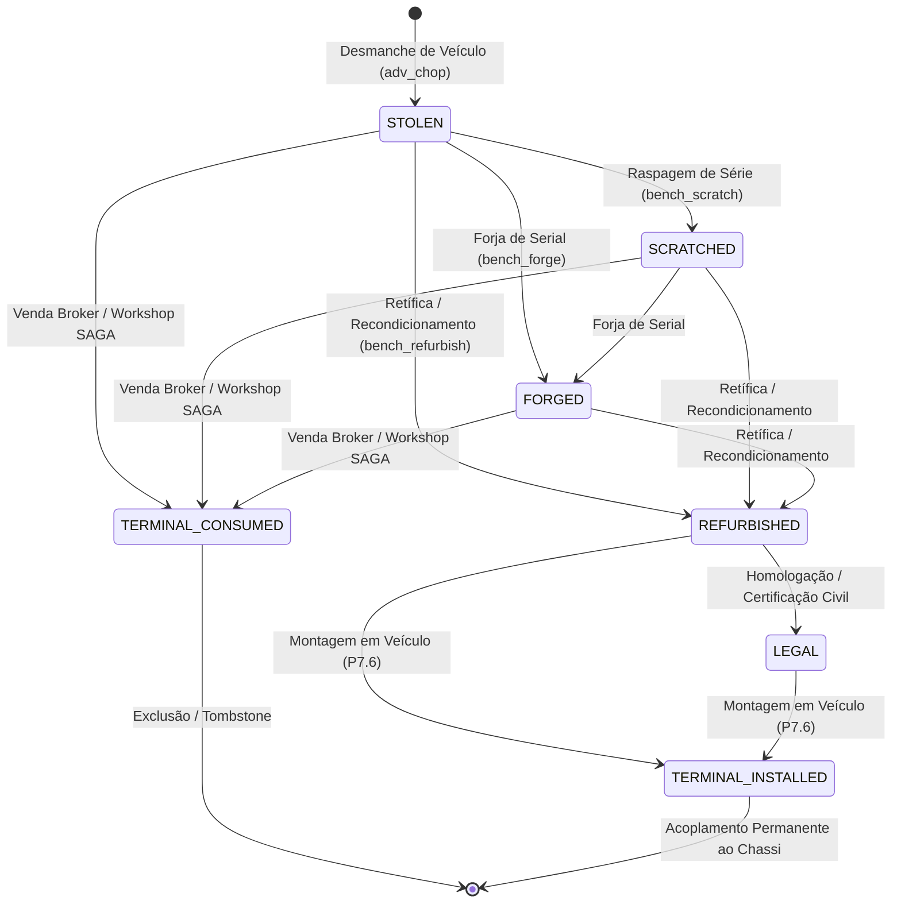

# RFC — P5.4: Persistent Physical Part & Provenance V2

> **Status:** CANONICAL SPECIFICATION / RFC  
> **Fase:** FASE 5 (v1.19) — Workshop Live & Durable Parts Foundation  
> **Dependências:** `PartEntitlement` (v1.16), `ChopSession` (v1.15)  
> **Escopo:** Modelo de dados durável, proveniência forense, ciclo de vida e binding com `ox_inventory`

---

## 1. Contexto & Problema

Na v1.16/v1.17, o `PartEntitlement` (`server/logistics/part_entitlement.lua`) resolveu com perfeição a **autoridade logística e posse temporal** de peças carregadas fisicamente nos braços do jogador (`physical carry`).

No entanto, o `PartEntitlement` é uma estrutura **in-memory**:
- Ao reiniciar o servidor FiveM, peças físicas soltas no chão ou transportadas perdem seu rastreamento fino de proveniência (`sourceModel`, serial único, desgaste/qualidade, veículo de origem).
- Ao avançarmos para oficinas reais (B2B), recondicionamento e montagem veicular (Fase 7), é imperativo que cada componente mecânico valioso possua uma **identidade durável** (`stablePartIdentity`) que sobreviva a quedas de banco, restarts e trocas de dono.

---

## 2. Modelo de Dados Durável (`vp_chop_physical_parts`)

```sql
CREATE TABLE IF NOT EXISTS `vp_chop_physical_parts` (
    `part_id` VARCHAR(64) NOT NULL,
    `part_type` VARCHAR(32) NOT NULL,
    `serial` VARCHAR(16) NULL,
    `source_vsid` VARCHAR(64) NULL,
    `source_model` VARCHAR(32) NOT NULL,
    `vehicle_class` TINYINT UNSIGNED NOT NULL,
    `condition_pct` DECIMAL(5,2) NOT NULL DEFAULT 100.00,
    `quality_tier` TINYINT UNSIGNED NOT NULL DEFAULT 1,
    `legal_state` ENUM('stolen', 'scratched', 'forged', 'refurbished', 'legal') NOT NULL DEFAULT 'stolen',
    `owner_citizenid` VARCHAR(64) NULL,
    `installed_vehicle_id` INT UNSIGNED NULL,
    `created_at` TIMESTAMP NOT NULL DEFAULT CURRENT_TIMESTAMP,
    `updated_at` TIMESTAMP NOT NULL DEFAULT CURRENT_TIMESTAMP ON UPDATE CURRENT_TIMESTAMP,
    PRIMARY KEY (`part_id`),
    INDEX `idx_owner` (`owner_citizenid`),
    INDEX `idx_serial` (`serial`),
    INDEX `idx_legal_state` (`legal_state`),
    INDEX `idx_installed` (`installed_vehicle_id`)
) ENGINE=InnoDB DEFAULT CHARSET=utf8mb4 COLLATE=utf8mb4_unicode_ci;
```

---

## 3. Máquina de Estados da Peça Física



---

## 4. Metadata Binding com `ox_inventory`

A peça física pode existir sob **3 formas no mundo FiveM**:
1. **Carregada nos braços (`physical carry`):** Governança ativa do `PartEntitlement` (`state = 'CARRIED'`, prop anexado ao ped).
2. **Depositada no chão (`part_pickup`):** Objeto com target `ox_target` ancorado nas coordenadas Z do solo (`state = 'DROPPED'`).
3. **Armazenada em inventário / baú:** Item genérico com metadata estrita vinculada ao `part_id`.

### Estrutura de Metadata do Item:
```lua
metadata = {
    partId       = 'part_e8f2a1b9-3c4d-4e5f-9a1b-2c3d4e5f6a7b',
    partType     = 'adv_engine',
    label        = 'Motor V8 (Sultan RS)',
    serial       = 'ENG-8842-X',
    sourceModel  = 'sultanrs',
    vehicleClass = 7,
    condition    = 94.5,
    legalState   = 'stolen',
    description  = 'Série: ENG-8842-X | Origem: Sultan RS | Estado: 94.5% (Ilegal)'
}
```

---

## 5. Invariantes & Regras Anti-Duplicação

1. **Unicidade Absoluta:** O `part_id` é gerado server-side via UUIDv4. Nenhuma operação de rede pode forçar um `part_id` arbitrário.
2. **Terminal Consumption Atomicity:**
   - Ao vender a peça ao Broker ou Oficina, o consumo no DB e no inventário ocorre dentro de transação SQL atômica (`MySQL.transaction.await`).
   - Se a transação falhar, a peça é colocada em `QUARANTINE` e o `PartEntitlement` bloqueia novas transferências até a resolução.
3. **Serial Immutability:**
   - O `serial` nunca pode ser revertido de `scratched` para `stolen`.
   - Séries forjadas recebem flag `legal_state = 'forged'` no banco de dados e são flagradas no scanner avançado com kit forense.
