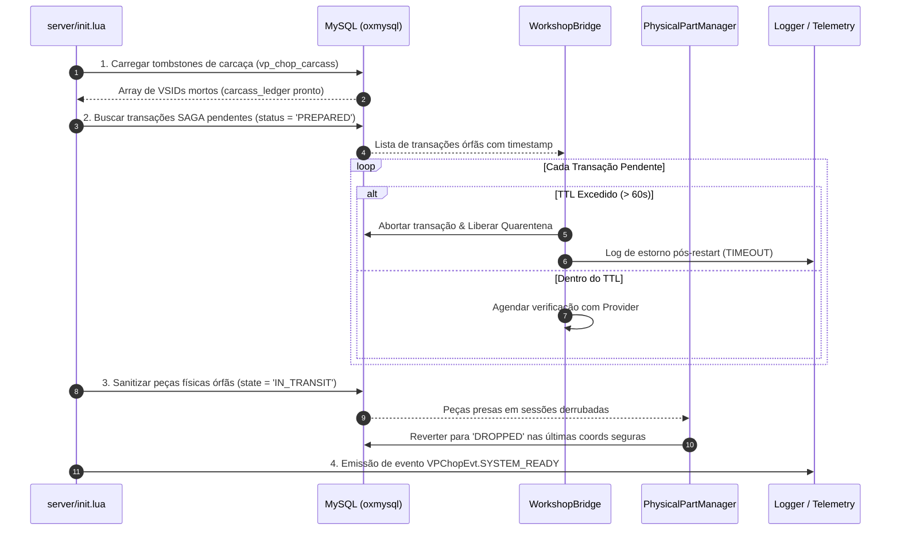

# RFC — P5.5: Selective Restart Recovery & Boot Reconciliation

> **Status:** CANONICAL SPECIFICATION / RFC  
> **Fase:** FASE 5 (v1.19) — Workshop Live & Durable Parts Foundation  
> **Dependências:** `RESTART_RECOVERY_STUDY.md`, `CarcassLedger` (v1.15), `P5.4 Physical Part`  
> **Escopo:** Protocolo de inicialização do servidor, reconciliação de transações SAGA, limpeza de sessões efêmeras e proteção contra duplicações pós-queda

---

## 1. Princípio Fundamental de Segregação

O `vp_chopshop` adota a regra canônica: **Não persistir tudo por padrão.**

```
┌─────────────────────────────────────────────────────────────────────────────────────────────┐
│ SEGREGAÇÃO DE ESTADO NO BOOT                                                               │
├───────────────────────────────┬─────────────────────────────────────────────────────────────┤
│ ESTADO EFÊMERO (VOLÁTIL)      │ - ChopSession (sessões de desmanche em progresso)           │
│ [LIMPO NO BOOT]               │ - ActionSession (ações físicas em curso: corte/perfuração) │
│                               │ - Cooldowns temporários de rate-limit em memória            │
│                               │ - Statebags de entidades transientes                        │
├───────────────────────────────┼─────────────────────────────────────────────────────────────┤
│ ESTADO DURÁVEL (PERSISTENTE)  │ - vp_chop_carcass (tombstones de carcaças descartadas)      │
│ [RECONCILIADO NO BOOT]        │ - vp_chop_physical_parts (peças físicas duráveis)           │
│                               │ - vp_chop_workshop_journal (SAGA em andamento)              │
│                               │ - vp_chop_fence_trust & progression (XP e reputação)        │
│                               │ - vp_chop_fake_plates & legit_serials                       │
└───────────────────────────────┴─────────────────────────────────────────────────────────────┘
```

---

## 2. Protocolo de Reconciliação no Boot (`onResourceStart`)

Quando o `vp_chopshop` inicia (após `MySQL.ready`), o reconciliador executa 4 etapas sequenciais determinísticas:



---

## 3. Resolução de Transações SAGA Pendentes (`vp_chop_workshop_journal`)

Se o servidor cair exatamente durante o estado `PREPARED` de uma compra de oficina:

1. **Consulta de Status:** No boot, o `WorkshopBridge` interroga o provider externo (`GetTransactionStatus(txId)`).
2. **Resolução Determinística:**
   - Se o provider confirma que a cobrança na oficina ocorreu $\to$ Executa `CommitPurchase` retroativo e destrói a peça.
   - Se o provider não reconhece a transação ou deu erro $\to$ Executa `AbortPurchase`, estorna qualquer valor retido e desmarca a quarentena da peça.
   - Se o provider estiver offline $\to$ Mantém a transação em `QUARANTINE_LOCKED` para auditoria manual pela staff sem travar a economia.

---

## 4. Garantia Anti-Re-Chop Cross-Restart

Para evitar que um veículo parcialmente desmanchado seja reiniciado e desmanchado novamente para duplicar recompensas:

- **Tombstones Persistentes:** O `CarcassLedger` consulta a tabela `vp_chop_carcass` por `vsid` ou `vehicleid` antes de qualquer tentativa de desmanche.
- **Fail-Closed em Desmanche Incompleto:** Se um carro não possui tombstone mas o motor já foi entregue como peça física (`part_id` gravado no DB com `source_vsid`), qualquer tentativa de re-desmanchar o mesmo motor é bloqueada pelo validador server-side.
