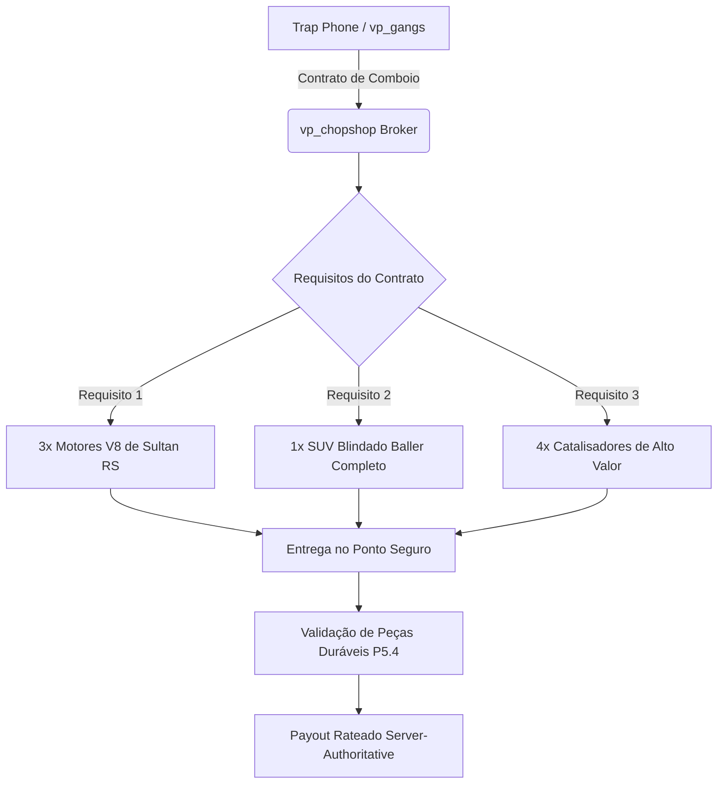

# RFC — Fase 6: Criminal Networks, Territories & Gangs Integration

> **Status:** CANONICAL SPECIFICATION / RFC  
> **Fase:** FASE 6 (v1.20) — Criminal Network & Gangs  
> **Dependências:** `VP_GANGS_CONTRACT` (v1.17), `P5.4 Persistent Physical Part`  
> **Escopo:** Taxas territoriais, contratos cooperativos de facção, compradores especializados e Trap Phone

---

## 1. Princípio de Separação de Domínios (`vp_chopshop` × `vp_gangs`)

A integração segue rigorosamente a fronteira canônica estabelecida no `VP_GANGS_CONTRACT.md`:

```
┌─────────────────────────────────────────────────────────────────────────────────────────────┐
│ FRONTEIRA CANÔNICA DE DOMÍNIOS                                                              │
├──────────────────────────────┬──────────────────────────────────────────────────────────────┤
│ DOMÍNIO DO VP_CHOPSHOP       │ - Veículo no mundo, NetId e Chassi                          │
│ (VEÍCULOS / MECÂNICA)        │ - Sessões de desmanche (ChopSession, ActionSession)          │
│                              │ - Peça física durável, serial, integridade e qualidade      │
│                              │ - Payout do desmanche e liquidez do Broker                   │
├──────────────────────────────┼──────────────────────────────────────────────────────────────┤
│ DOMÍNIO DO VP_GANGS          │ - Identidade da facção, membros, cargos e territórios        │
│ (SOCIAL / CRIME ORGANIZADO)  │ - Controle de zonas de desmanche e taxas de comissão         │
│                              │ - Contatos sociais (Trap Phone, Mecânico Fantasma, etc.)     │
│                              │ - Reputação criminal e lavagem de dinheiro                   │
└──────────────────────────────┴──────────────────────────────────────────────────────────────┘
```

---

## 2. Taxas Territoriais & Chop Zones (P6.1 / P6.2 / P6.3)

Quando um jogador realiza o desmanche de uma peça ou a entrega de um veículo em uma área controlada:

1. **Consulta Territorial:** O `vp_chopshop` invoca `bridge/vp_gangs.lua:GetTerritoryOwner(coords)`.
2. **Aplicação de Regras:**
   - **Membro da Facção Dominante:** Recebe bônus econômico (ex.: +10% de payout) e redução na geração de heat policial (`P6.2`).
   - **Jogador Neutro / Civil:** O desmanche retém automaticamente a taxa territorial configurada (ex.: 15%), creditando o cofre da facção dona da zona via bridge (`P6.1`).
   - **Facção Rival:** Desmanchar em território inimigo gera um alerta silencioso no rádio/painel da facção dominante com a localização aproximada (`P6.3`).

---

## 3. Contratos Cooperativos de Facção (P6.4)

Contratos de grande porte que exigem ação coordenada de múltiplos jogadores de uma mesma organização criminal:



- **Divisão de Lucros Server-Authoritative:** O payout não é entregue a um único jogador para "repassar manualmente". O servidor distribui os créditos proporcionalmente entre os participantes registrados no contrato.

---

## 4. Compradores Especializados do Submundo (P6.5 / P6.6)

Em vez de vender tudo para um único NPC genérico, surgem canais especializados no mercado negro:

| Comprador | Especialidade | Requisitos Forenses do `vp_chopshop` | Canal de Comunicação |
|---|---|---|---|
| **O Mecânico Fantasma** | Motores de alta cilindrada (V8, Turbo) | `part_type = 'adv_engine'`, `condition_pct >= 85.0` | Trap Phone (`vp_gangs`) |
| **O Receptor de Metais** | Catalisadores e metais nobres | `part_type = 'catalytic_converter'`, serial riscado | Contato Físico nas Docas |
| **O Hacker de ECUs** | Módulos eletrônicos e rastreadores desativados | `legal_state = 'scratched'`, sem alarmes ativos | Rádio Criptografado |

### Invariante de Segurança:
O `vp_gangs` gerencia o contato e a autorização social; o `vp_chopshop` é quem valida fisicamente a integridade, compatibilidade e autenticidade da peça antes de comutar a transação.
